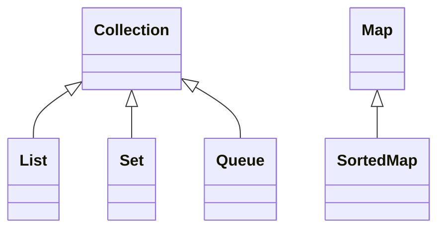
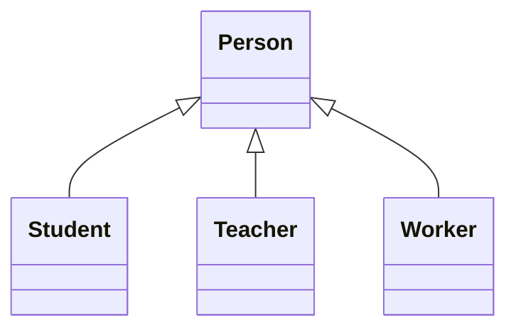
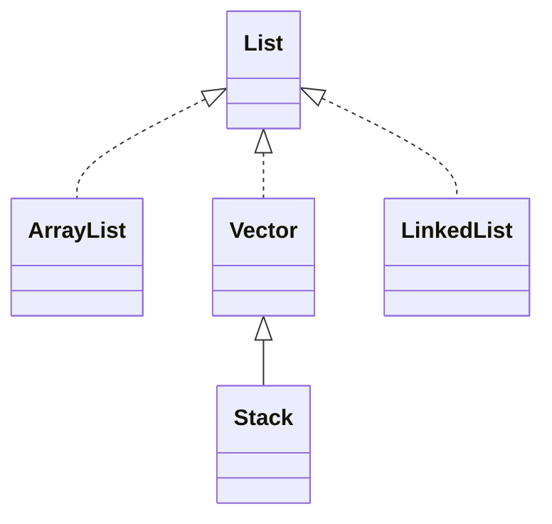
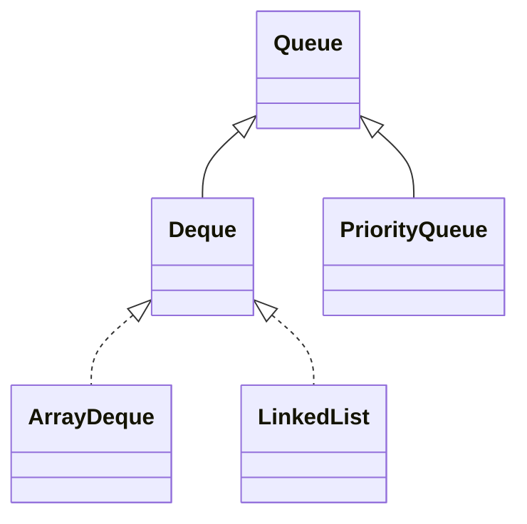
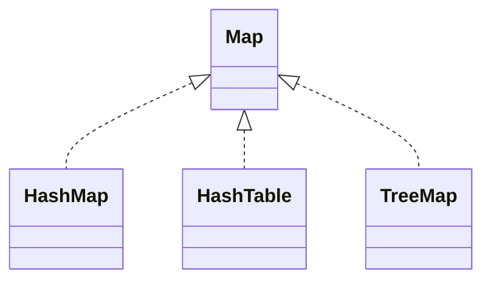

# 11章 泛型和集合

#### 11.1.1 泛型类型

（1） 单参数，T可以表示多种类型。

```java
class Node<T>
{
private T v;
Node(){}
Node(T v)
{this.v=v;}
public T get()
{
	return this.v;
}
public void set(T t)
{this.v = t;}
}

public class Tutorial1
{public static void main(String[] args)
{
	Node<Double> d1 = new Node<>();
	d1.set(new Double(23.14));
	System.out.println(d1.get());
	Node<Integer> d2 = new Node<>();
	d2.set(new Integer(45));
	System.out.print(d2.get());
}}
```
（2）多个参数，K, V Python的字典类型

```java
interface Entry<K,V>
{
	public K getKey();
	public V getValue();
}

class Pair<K,V> implements Entry<K,V>
{
	private K key;
	private V value;
	Pair(K key, V value)
	{
		this.key = key;
		this.value = value;
	}
	public void setKey(K key)
	{
		this.key = key;
	}
	public void setValue(V value)
	{
		this.value =value;
	}
	public K getKey()
	{
		return this.key;
	}
	public V getValue()
	{
		return this.value;
	}
}

public class Tutorial2
{
	public static void main(String[] args)
	{
		Pair<String,Double> p = new Pair<String,Double>("100001",25.677);
		System.out.println(p.getKey());
		System.out.println(p.getValue());
	}
}
```

#### 11.1.2 泛型方法

```java
class Util
{
	public static <T> void swap(T[] array, int i, int j)
	{
		T t = array[i];
		array[i] = array[j];
		array[j] = t;		
	}
}

public class Tutorial3
{
	public static void main(String[] args)
	{
		Integer[] num = {3,4,4,5,5};
		Util.<Integer>swap(num,0,3);
		for(Integer x: num)
		{
			System.out.println(x);
		}
	}
}
```

#### 11.1.3 通配符？

List<Object> list1 =  new ArrayList<Object>();

List<String> list2 =  new ArrayList<String>();

String是Object类的子类，但是list2不是list1的子类。?表示通配符。

```java
import java.util.ArrayList;
import java.util.List;

public class Tutorial4
{
	public static void printList(List<?> list)
	{
		for(Object o:list)
		{
			System.out.println(o);
		}
	}
	public static void main(String[] args)
	{
    List<Object> list1 =  new ArrayList<Object>();
    List<String> list2 = new ArrayList<String>();
    list2.add(new String("zhang"));
    list2.add(new String("wang"));
    printList(list2);
    }
}
```

#### 11.1.4 有界的类型参数

```java
import java.util.ArrayList;
import java.util.List;
import java.util.Iterator;

public class Test93
{
	public static void printList(List<?> list)
	{
		for(Object o:list)
		{
			System.out.println(o);
		}
	}
	public static double getAverage(List<? extends Number> list)
	{
		double average = 0;
		for(Number n:list)
		{
			average+=n.doubleValue();
		}
		return average/list.size();
	}

	public static void main(String[] args)
	{
    List<Object> list1 =  new ArrayList<>();
    List<Integer> list2 = new ArrayList<>();
    list2.add(new Integer(23));
    list2.add(new Integer(45));
    list2.add(new Integer(56));
    list2.add(1,new Integer(1122));
    printList(list2);
    System.out.println(getAverage(list2));
    }
}
```

## 11.2  集合框架



#### 11.2.1 Liskov Substitution Principle 

Subtypes must be substitutable for their base types




## 11.3 List接口及实现类



| List接口 | 元素操作                                                     |                                              |
| -------- | ------------------------------------------------------------ | -------------------------------------------- |
| 查找元素 | E get(int index)                                             | 返回指定下标处的元素                         |
|          | E set(int index, E element)                                  | 修改指定下标处的元素                         |
| 添加元素 | void add(int index, E element)                               | 将指定元素插入到指定下标处                   |
|          | E remove(int index)                                          | 删除指定下标处的元素                         |
|          | abstract boolean addAll(int index, Collection<? extends E> c) | 在指定下标处插入集合c中的全部元素            |
|          | int indexOf(Object o)                                        | 查找指定对象第一次出现的位置                 |
|          | int lastIndexOf(Obejct o)                                    | 查找指定对象最后一次出现的位置               |
|          | List<E> subList(int from int to)                             | 返回从from到to元素的一个子线性表             |
|          | default void replaceAll(UnaryOperator<E> operator)           | 将操作符应用于元素，并使用其结果替代每个元素 |


#### 11.3.1 List操作

```java
import java.util.ArrayList;
import java.util.List;

public class Tutorial5
{
	public static void main(String[] args)
	{
    List<Object> list1 =  new ArrayList<Object>();
    List<Integer> list2 = new ArrayList<>();
    list2.add(new Integer(23));
    list2.add(new Integer(45));
    list2.add(new Integer(56));
    list2.add(1,new Integer(1122));
    System.out.print(list2.size());
    System.out.println(list2);
    list1.addAll(list2);
    System.out.println(list1);
    list1.remove(1);
    System.out.println(list1);
    list2.forEach(System.out::println);
    }
}
```

#### 11.3.3 三种循环方法

```java
import java.util.ArrayList;
import java.util.Arrays;
import java.util.List;
import java.util.Iterator;
import java.util.ListIterator;

public class Tutorial6
{
	public static void main(String[] args)
	{
    List<Integer> list2 = new ArrayList<>();
    list2.add(new Integer(23));
    list2.add(new Integer(45));
    list2.add(new Integer(56));
    list2.add(1,new Integer(1122));
    String[] str = {"test","java","matlab"};
    List<String> list = Arrays.asList(str);
    // 1、普通的for循环
    for(int i = 0;i<list.size();i++)
    {
    	System.out.print(list.get(i)+"\t");
    }
    // 2、增强的for循环
    for(Integer x: list2)
     {
     	System.out.print(x+"\t");
    / }
    // 2、forEach方法
    list2.forEach(System.out::print);
    // 3、Iterator迭代器 
    Iterator iter = list2.iterator();
    while(iter.hasNext())
    {
    	System.out.println(iter.next());
     }
    // 4、双向迭代器 ListIterator
    ListIterator iter = list2.listIterator();
    while(iter.hasNext())
    {
        System.out.print(iter.next()+"\t");
    }
    System.out.println("--------");
    while(iter.hasPrevious())
    {
        System.out.print(iter.previous()+"\t");
    }
    }
}
```

### 11.4 Set接口及实现类

#### 11.4.1 HashSet类

```java
import java.util.HashSet;
import java.util.Set;
import java.util.List;
import java.util.ArrayList;
public class Tutorial7
{
	public static void main(String[] args)
	{
    Set<String> set1 = new HashSet<>();
    set1.add("java");
    set1.add("python");
    set1.add("python");
    set1.add("matlab");
    for(String s:str)
    {
        System.out.println(s);
    }
    List<String> list1 = new ArrayList<>();
    list1.add("go");
    list1.add("java");
    list1.add("java");
    Set<String> set2 = new HashSet<>(list1);
    for(String s:set2)
    {
        System.out.println(s);
    }
    set1.addAll(set2);
    set1.retainAll(set2);
    set1.removeAll(set2);
    for(String s:set1)
    {
        System.out.println(s);
    }
    if(set1.containsAll(set2))
    {
        System.out.print("True");
    }
    else
    {
        System.out.print("False");
    }
    }
}
```

#### 11.4.3 TreeSet类

```java
import java.util.TreeSet;
import java.util.Set;
import java.util.List;
import java.util.ArrayList;
public class Tutorial8
{
	public static void main(String[] args)
	{
        Set<String> set1 = new TreeSet<>();
        String[] s1 = {"zoo","python","java","go"};
        for(int i=0;i<s1.length;i++)
        {
            set1.add(s1[i]);
        }
        System.out.print(set1);
        System.out.print("\n");
        set1 = new TreeSet<>((String s, String s2) -> s2.compareTo(s));
        for(int i=0;i<s1.length;i++)
        {
            set1.add(s1[i]);
        }
        System.out.print(set1);
    }
}
```

### 11.5 Queue接口及实现类



| Queue操作类型 | 元素操作         | 队尾元素操作                 |
| ------------- | ---------------- | ---------------------------- |
| 插入元素      | boolean add(e)   | 将指定的元素e插入队列中      |
|               | boolean offer(e) | 将指定的元素e插入队列中      |
| 删除元素      | remove()         | 返回队列头元素，同时将其删除 |
|               | element()        | 返回队列头元素，但不将其删除 |
| 返回元素      | poll()           | 返回队列头元素，同时将其删除 |
|               | peek()           | 返回队列头元素，但不将其删除 |


#### 11.5.1 Queue接口和Deque接口


| Deque操作类型 | 队首元素操作  | 队尾元素操作 |
| ------------- | ------------- | ------------ |
| 插入元素      | addFirst(e)   | addLast(e)   |
|               | offerFirst(e) | offerLast(e) |
| 删除元素      | removeFirst() | removeLast() |
|               | pollFirst()   | pollLast()   |
| 返回元素      | getFirst()    | getLast()    |
|               | peekFirst()   | peekLast()   |

1、Queue接口（用接口声明、用具体类实现）

```java
import java.util.Queue;
import java.util.Deque;
import java.util.ArrayDeque;
class Person
{
	private String name;
	private int age;
	Person(String n, int a)
	{
	this.name=n;
	this.age=a;
	}
	public String toString()
	{
		return this.name + this.age;
	}
}
class Tutorial11
{
public static void main(String[] args)
{
	Queue<Person> que = new ArrayDeque<>();
	que.add(new Person("wang",23));
	que.add(new Person("zhang",25));
	que.add(new Person("liu",45));
	Person p = (Person)que.poll();
	System.out.println(p.toString()+"\n"+"-----");
	for(Person q:que)
	{
		System.out.println(q.toString());
	}
}	
}
```

2、Deque接口（用接口声明、用具体类实现）

```java
import java.util.Queue;
import java.util.Deque;
import java.util.ArrayDeque;
class Tutorial12
{
public static void main(String[] args)
{
	Deque<Person> que = new ArrayDeque<>();
	que.addFirst(new Person("wang",23));
	que.addFirst(new Person("zhang",25));
	que.addFirst(new Person("liu",45));
	Person p = (Person)que.pollFirst();
	System.out.println(p.toString()+"\n"+"-----");
	for(Person q:que)
	{
		System.out.println(q.toString());       //for增强循环
	}
	que.forEach((x) -> System.out.println(x));  //Lambda表达式
	que.forEach(System.out::println);          //方法引用
}	
}
```

#### 11.5.2 ArrayDeque类和LinkedList类

1、addFirst()方法添加到Deque的头部，addLast()方法添加到Deque的尾部。


```java
import java.util.Deque;
import java.util.ArrayDeque;
import java.util.Iterator;
import java.util.ArrayList;
public class Tutorial13
{
	public static void main(String[] args)
	{
        Person[] array = {new Person("wang",12),new Person("liu",45),new Person("zhang",34),new Person("xu",22)};
        Deque<Person>  que = new ArrayDeque<>();
        for(int i=0;i<array.length-2;i++)
        {
            que.addFirst(array[i]);
        }
        for(int i=array.length-2;i<array.length;i++)
        {
            que.addLast(array[i]);
        }
        Iterator iter = que.iterator();
        while(iter.hasNext())
        {
           Person p = (Person)iter.next();
           System.out.print(p.toString()+"\n");
        }
    }
}
```

2、LinkedList，LinkedList同时实现了List接口和Queue接口，下面的例子实现了Queue接口。

```java
import java.util.Queue;
import java.util.ArrayDeque;
import java.util.Iterator;
import java.util.LinkedList;
public class Tutorial11
{
	public static void main(String[] args)
	{
        Person[] array = {new Person("wang",12),new Person("liu",45),new Person("zhang",34),new Person("xu",22)};
        Queue<Person>  que = new LinkedList<>();
        for(int i=0;i<array.length-2;i++)
        {
            que.add(array[i]);
        }
        for(int i=array.length-2;i<array.length;i++)
        {
            que.add(array[i]);
        }
        while(!que.isEmpty())
        {
        	System.out.print(que.remove());
        	try
        	{
        		Thread.sleep(10000);
        	}
        	catch(InterruptedException e)
        	{
        		e.printStackTrace();
        	}
        }
    }
}
```

LinkedList实现了List接口

```java
import java.util.Queue;
import java.util.Iterator;
import java.util.LinkedList;
import java.util.List;
public class Tutorial12
{
	public static void main(String[] args)
	{
        Person[] array = {new Person("wang",12),new Person("liu",45),new Person("zhang",34),new Person("xu",22)};
        List<Person>  que = new LinkedList<>();
        for(int i=0;i<array.length-2;i++)
        {
            que.add(array[i]);
        }
        for(int i=array.length-2;i<array.length;i++)
        {
            que.add(array[i]);
        }
        for(int i=0;i<que.size();i++)
        {
        	System.out.print(que.get(i)+"\n");
        }
    }
}
```

#### 11.5.3 集合转换

集合实现类的构造方法一般都接受一个Collection对象，可以将Collection转换成不同的类型的集合。

```java
import java.util.Queue;
import java.util.LinkedList;
import java.util.List;
import java.util.ArrayList;
import java.util.Arrays;
import java.util.HashSet;

public class Tutorial13
{
	public static void main(String[] args)
	{
        Person[] array = {new Person("wang",12),new Person("liu",45),new Person("zhang",34),new Person("xu",22)};
        List<Person> list = new ArrayList<>();
        list.addAll(Arrays.asList(array));
        HashSet<Person> hashset = new HashSet<>(list);
        Queue<Person> linkedlist = new LinkedList<>(list);
        list.forEach(x -> System.out.println(x));
        hashset.forEach(x -> System.out.println(x));
        linkedlist.forEach(x -> System.out.println(x));
    }
}
```

### 11.6 Map接口及实现类

#### 11.6.1 Map接口



1.基本操作

| Map接口  | 元素操作                            |                               |
| -------- | ----------------------------------- | ----------------------------- |
| 插入元素 | V put(K key, V value)               | 向映射对象中添加一个“键/值”对 |
|          | V get(Object key)                   | 返回指定键的值                |
| 删除元素 | V remove(Object key)                | 返回队列头元素，同时将其删除  |
|          | boolean containsKey(Object key)     | 返回队列头元素，但不将其删除  |
| 返回元素 | boolean containsValue(Object value) | 返回队列头元素，同时将其删除  |
|          | default V replace(K key, V value)   | 返回队列头元素，但不将其删除  |
|          | default void forEach()              |                               |
|          | int size()                          |                               |
|          | boolean isEmpty()                   |                               |

- - public V put(K key, V value)

#### 11.6.2 Map接口的实现类

1. HashMap类

```java
import java.util.HashMap;
import java.util.Map;
import java.util.Set;
import java.util.ArrayList;
import java.util.Collection;
public class Tutorial14
{
	public static void main(String[] args)
	{
        int[] keys = {1,2,3,4,5};
        String[] str = {"html","java","go","python","javascript"};
        Map<Integer,String> maps = new HashMap<>();
        for(int i=0;i<keys.length;i++)
        {
            maps.put(keys[i],str[i]);
        }
        // maps.forEach((x,y)->System.out.print(x+" " +y +"\t"));
        Set<Integer> k = maps.keySet();
        k.forEach(System.out::println);
        Collection<String> v = maps.values();
        v.forEach(System.out::println);
    }
}
```

2. TreeMap类

TreeMap类实现了SortedMap接口，保证Map中的“键/值”对按关键字升序排序。以下是统计txt文件内国家名字出现的次数。

```java
import java.util.HashMap;
import java.util.Map;
import java.util.Set;
import java.util.TreeMap;
import java.util.Collection;
import java.io.*;

public class Tutorial15
{
	public static void main(String[] args)
	{
        String line = null;
        String[] words  = null;
        Map<String,Integer> maps = new TreeMap<>();        
        try
        {
            BufferedReader buff = new BufferedReader(new FileReader("proverb.txt"));
            while((line = buff.readLine())!=null)
            {
            words = line.split("[,.]");
            for(String s: words)
            {
                Integer count = maps.get(s);
                if(count == null)
                {
                    maps.put(s,1);
                }
                else
                {
                    maps.put(s,count+1);
                }
            }
        }
           System.out.println(maps.size()+"个国家");
           System.out.print(maps);
        }
        catch(FileNotFoundException e)
        {
            e.printStackTrace();
        }
        catch(IOException e)
        {
            e.printStackTrace();
        }
    }
}
```

3. HashTable类和Enumeration类


### 11.7 Collection类

1. 排序
2. 查找
3. 打乱元素次序
4. 求极值
5. 其他常用方法


### 11.8 Stream API

#### 11.8.1 流概述


#### 11.8.2 创建与获得流


#### 11.8.3 连接流和限制流


#### 11.8.4 过滤流


#### 11.8.5 流转换


#### 11.8.6 流规约


#### 11.8.7 收集结果


#### 11.8.8 基本类型流


#### 11.8.9 并行流

