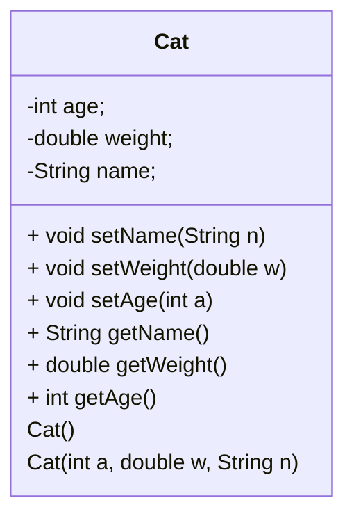
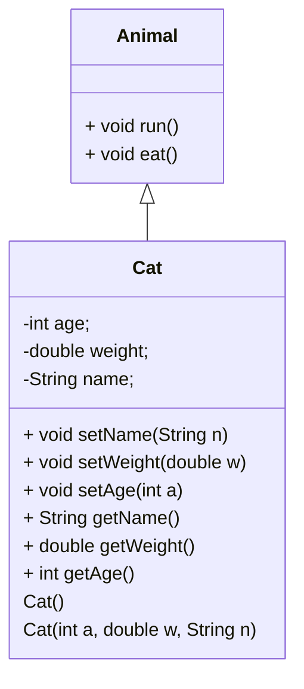
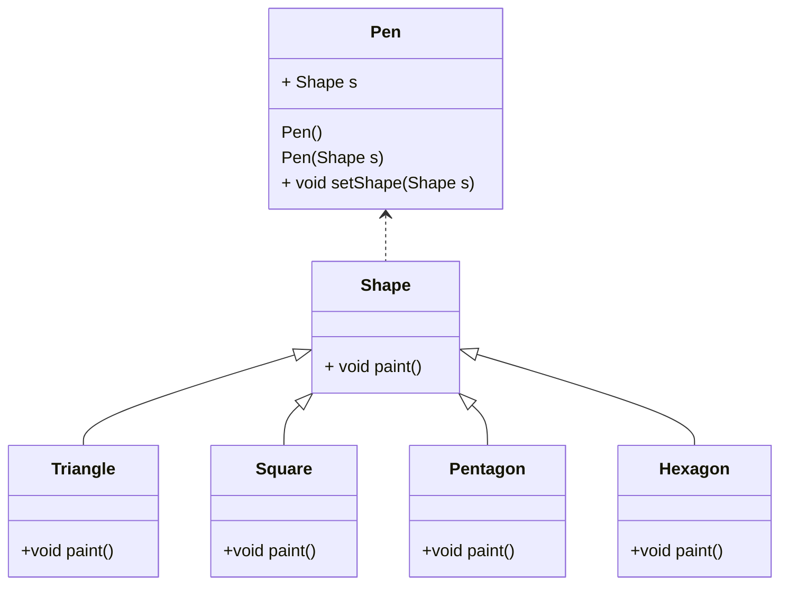

# 第五课--类和对象

### 任务目标

1、类的定义

2、对象和类的关系，is-a和has-a

3、属性、行为、构造方法、访问权限、方法重载和方法覆盖

### 相关知识

1、类、对象、属性、行为、构造方法、访问权限、方法重载、Static属性和方法。

2、方法重载（方法名相同，参数列表不同）

3、构造方法（与类同名，无返回值）

### 1、类的设计



```java
import java.lang.Math;
import java.util.Scanner;

class Cat
{
  	private int age;
    private double weight;
    private String name;
    public void setName(String n)
    {
        this.name = n;
    }
    public void setWeight(double w)
    {
        this.weight = w;
    }
    public void setAge(int a)
    {
        this.age=a;
    }
  	public String getName()
    {
        return this.name;
    }
  	public double getWeight()
    {
        return this.weight;
    }
  	public int getAge()
    {
        return this.age;
    }
    public void printinfo() //功能的内聚
    {
        System.out.print(this.getName()+"\n");
        System.out.print(this.getAge()+"\n");
        System.out.print(this.getWeight()+"\n");
    }
    public void printinfo(int a)
    {
        System.out.print(a+"\n");
    }
    Cat()
    {
        
    }
    Cat(int a)
    {
        this();
        this.age=a;
    }
  	Cat(int a, double w, String n)
    {
        this.age=a;
        this.weight=w;
        this.name=n;
    }
}

public class Test1
{
    public static void main(String[] args)
    {
		Cat c1  =new Cat();
        Cat c2 = new Cat(3,32,"Panda");
        Cat c3 = new Cat(13);
        c1.setName("Kitty");
        c1.setAge(4);
        c1.setWeight(20);
        c1.printinfo();
        c2.printinfo();
        c2.printinfo(3);
        // System.out.print(c1.getName()+"\n");
        // System.out.print(c1.getAge()+"\n");
        // System.out.print(c1.getWeight()+"\n");
        // System.out.print(c2.getName()+"\n");
        // System.out.print(c2.getAge()+"\n");
        // System.out.print(c2.getWeight()+"\n");
    }
}
```

### 2、Static属性

1、Static变量是全局变量

```java
import java.lang.Math;
import java.util.Scanner;

class Cat
{
  	private int age;
    private double weight;
    private String name;
    static int num;  //Staic 属性
    public void setName(String n)
    {
        this.name = n;
    }
    public void setWeight(double w)
    {
        this.weight = w;
    }
    public void setAge(int a)
    {
        this.age=a;
    }
  	public String getName()
    {
        return this.name;
    }
  	public double getWeight()
    {
        return this.weight;
    }
  	public int getAge()
    {
        return this.age;
    }
    public void printinfo()
    {
        System.out.print(this.getName()+"\n");
        System.out.print(this.getAge()+"\n");
        System.out.print(this.getWeight()+"\n");
    }
    public void printinfo(int a)
    {
        System.out.print(a+"\n");
    }
    Cat()
    {
        num++;
    }
    Cat(int a)
    {
        this.age=a;
        num++;
    }
  	Cat(int a, double w, String n)
    {
        this.age=a;
        this.weight=w;
        this.name=n;
        num++;
    }
}

public class Test1
{
    public static void main(String[] args)
    {
		Cat c1  =new Cat();
        Cat c2 = new Cat(3,32,"Panda");
        Cat c3 = new Cat(13);
        c1.setName("Kitty");
        c1.setAge(4);
        c1.setWeight(20);
        System.out.print(Cat.num+"\n");
    }
}
```

2、Static变量可以通过对象名、类名或者静态方法进行访问。

```java
import java.lang.Math;
import java.util.Scanner;

class Cat
{
  	private int age;
    private double weight;
    private String name;
    static int num;
    public static int getNum()
    {
        return num;
    }
    public void setName(String n)
    {
        this.name = n;
    }
    public void setWeight(double w)
    {
        this.weight = w;
    }
    public void setAge(int a)
    {
        this.age=a;
    }
  	public String getName()
    {
        return this.name;
    }
  	public double getWeight()
    {
        return this.weight;
    }
  	public int getAge()
    {
        return this.age;
    }
    public void printinfo()
    {
        System.out.print(this.getName()+"\n");
        System.out.print(this.getAge()+"\n");
        System.out.print(this.getWeight()+"\n");
    }
    public void printinfo(int a)
    {
        System.out.print(a+"\n");
    }
    Cat()
    {
        num++;
    }
    Cat(int a)
    {
        this.age=a;
        num++;
    }
  	Cat(int a, double w, String n)
    {
        this.age=a;
        this.weight=w;
        this.name=n;
        num++;
    }
}

public class Test1
{
    public static void main(String[] args)
    {
		Cat c1  =new Cat();
        Cat c2 = new Cat(3,32,"Panda");
        Cat c3 = new Cat(13);
        c1.setName("Kitty");
        c1.setAge(4);
        c1.setWeight(20);
        System.out.print(c1.num+"\n");
        System.out.print(Cat.num+"\n");
        System.out.print(Cat.getNum()+"\n");
    }
}
```

### 3、继承



```java
import java.lang.Math;
import java.util.Scanner;

class Animal 
{
    public void run()
    {
        System.out.print("Animal Run\n");
    }

    public void eat()
    {
        System.out.print("Animal Eat\n");
    }
}

class Cat extends Animal
{
  	private int age;
    private double weight;
    private String name;
    static int num;
    public static int getNum()
    {
        return num;
    }
    public void setName(String n)
    {
        this.name = n;
    }
    public void setWeight(double w)
    {
        this.weight = w;
    }
    public void setAge(int a)
    {
        this.age=a;
    }
  	public String getName()
    {
        return this.name;
    }
  	public double getWeight()
    {
        return this.weight;
    }
  	public int getAge()
    {
        return this.age;
    }
    public void printinfo()
    {
        System.out.print(this.getName()+"\n");
        System.out.print(this.getAge()+"\n");
        System.out.print(this.getWeight()+"\n");
    }
    public void printinfo(int a)
    {
        System.out.print(a+"\n");
    }
    Cat()
    {
        num++;
    }
    Cat(int a)
    {
        this.age=a;
        num++;
    }
  	Cat(int a, double w, String n)
    {
        this.age=a;
        this.weight=w;
        this.name=n;
        num++;
    }
    public void run()
    {
        System.out.print("Cat Run\n");
    }

    public void eat()
    {
        System.out.print("Cat Eat\n");
    }
}

public class Test1
{
    public static void main(String[] args)
    {
        Cat c2 = new Cat(3,32,"Panda");
        c2.run();
        c2.eat();
    }
}
```

### 4、多态



```java
class Shape
{
    public void paint()
    {
        System.out.print("paint");
    }
}

class Triangle extends Shape
{
    public void paint()
    {
        System.out.println(" /\\");
        System.out.println("/__\\");
    }
}

class Square extends Shape
{
    public void paint()
    {
        System.out.println("|---|");
        System.out.println("|---|");
        
    }
}

class Pentagon extends Shape
{
    public void paint()
    {
		System.out.print("pentagen paint");
       
    }
}

class Pen 
{
    private Shape s;
    Pen()
    {
        
    }
    Pen(Shape s)
    {
        this.s = s;
    }
    public void draw()
    {
        s.paint();
    }
    public void setShape(Shape s)
    {
        this.s=s;
    }
}

public class Test3
{
    public static void main(String[] args)
    {
        Shape s = new Triangle();
        Pen p = new Pen();
        s = new Square();
        p.setShape(s);
        p.draw();
    }    
}
```

### 5、单例模式

```java
class RecycleBin
{
	private static RecycleBin r = null;
	private String name;
	private int age;
	private RecycleBin()
	{
	}
	public static RecycleBin getInstance()
	{
		if(r==null)
		{
			r = new RecycleBin();
		}
		return r;
	}
	public void restore()
	{

	}
	public void delete()
	{

	}
}
class Test10
{
	public static void main(String[] args)
	{
		Singleton p = Singleton.getInstance("zhang",23);
		Singleton p1 = p;
		Singleton p2 = Singleton.getInstance("wang",45);
		System.out.print(p2.getName());
		System.out.print(p2.getAge());
	}
}

```

### 6、简单工厂模式

```java
class Device
{
	public void info()
	{
		System.out.print("Device\n");
	}
}

class Tv extends Device
{
	public void info()
	{
		System.out.print("Tv\n");
	}
}

class Phone extends Device
{
	public void info()
	{
		System.out.print("Phone\n");
	}
}

class Factory
{
	public static Device p = null;

	public static Device getInstance(String type)
	{
		if(type.equals("TV"))
		{
			p = new Tv();
		}
		if(type.equals("Phone"))
		{
			p = new Phone();
		}
		return p;
	}
}

public class Test12
{
	public static void main(String[] args)
	{
		Device[] d = new Device[3];
		d[0] = Factory.getInstance("TV");
		d[1] = Factory.getInstance("Phone");
		d[2] = Factory.getInstance("TV"); 
		for(int i=0;i<3;i++)
		{
			d[i].info();
		}
	}
}
```

