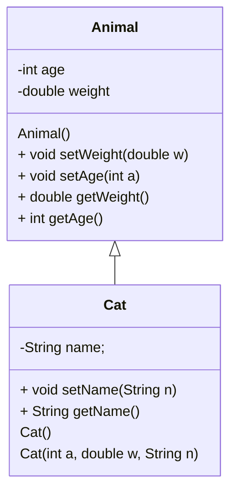
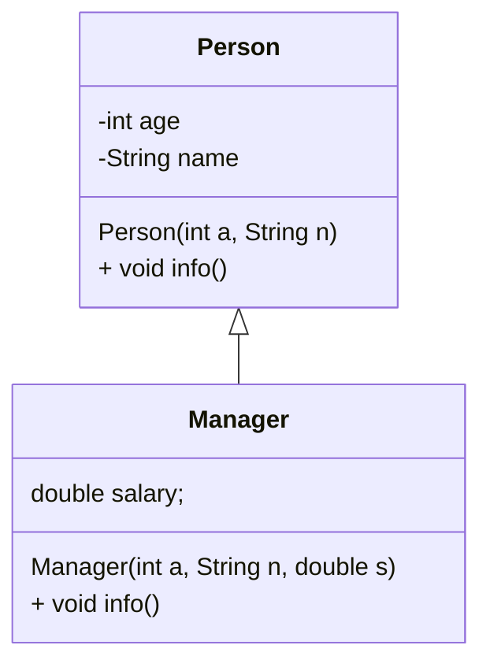
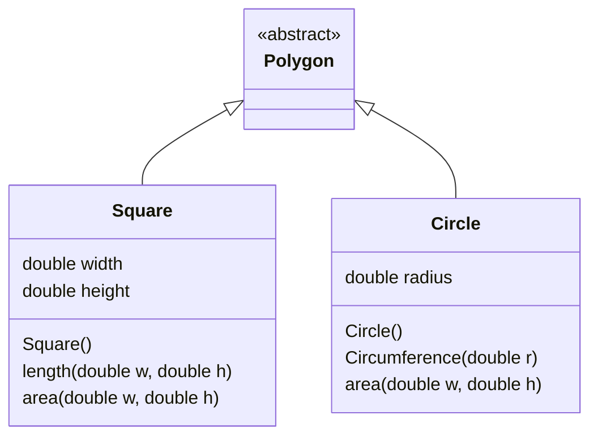

# 第七讲--继承与多态

### 任务目标

1、类的继承、Super关键词

2、方法的覆盖

3、Super关键词

### 相关知识

1、多态

2、对象数组的初始化

3、对象数组的排序

### 1、类继承的实现



1、定义Animal类，还有Cat类，Cat is Animal。


```java
import java.util.regex.*;
class Animal
{
    private int age;
    private double weight;
    Animal()
    {

    }
    Animal(int a, double w)
    {
        this.age=a;
        this.weight=w;
    }
    public int getAge()
    {
        return this.age;
    }
    public double getWeight()
    {
        return this.weight;
    }
    public void setAge(int a)
    {
        this.age=a;
    }
    public void setWeight(double w)
    {
        this.weight =w;
    }
}

class Cat extends Animal
{
    private String name;
    Cat(){

    }
    Cat(int a, double w, String n)
    {
        super(a,w);
        this.name=n;
    }
    public void setName(String n)
    {
        this.name=n;
    }
    public String getName()
    {
        return this.name;
    }
}
public class Test61
{
    public static void main(String[] args)
    {
        Cat c = new Cat(4,4,"kitty");
        System.out.println(c.getName());
        System.out.println(c.getWeight());
        System.out.println(c.getAge());
    }
}
```

### 2、方法的覆盖（overriding）

1、子类覆盖父类的方法



1、Manager类的info方法覆盖Person类的info方法

```java
class Person
{
    int age;
    String name;
    Person()
    {}
    Person(int a, String n)
    {
        this.age=a;
        this.name=n;
    }
    public void info()
    {
        System.out.println(this.age);
        System.out.print(this.name);
    }
}

class Manager extends Person 
{
    double salary;
    Manager(int a, String n, double s)
    {
        super(a,n);
        this.salary =s;
    }
    public void info()
    {
        System.out.println(this.age);
        System.out.println(this.name);
        System.out.print(this.salary);
    }
    public void info(int a)
    {
        System.out.println(this.age);
        System.out.println(this.name);
        System.out.print(this.salary);
    }
}


public class Test62
{
    public static void main(String[] args)
    {
        Person white = new Manager(23,"White",4500.0);
        white.info();
    }
}
```

### 3、super和this关键词的使用

1、super方法和this方法的使用，super和this单独使用，是调用构造方法，super和this结合函数名是调用父类和当前类的其他方法。

````java
class Person
{
    int age;
    String name;
    Person(int a)
    {
        this.age=a;
    }
    Person(int a, String n)
    {
        this(a);
        this.name=n;
    }
    public void info()
    {
        System.out.println(this.age);
        System.out.print(this.name);
    }
}

class Manager extends Person 
{
    double salary;
    Manager(int a, String n)
    {
        super(a,n);
    }
    Manager(int a, String n, double s)
    {
        this(a,n);
        this.salary =s;
    }
    public void info()
    {
        super.info();
        this.info1();
    }
    public void info1()
    {
        System.out.print(this.salary);
    }
}

public class Test62
{
    public static void main(String[] args)
    {
        Manager white = new Manager(23,"White",4500.0);
        white.info();
    }
}
````

### 4、变量的权限和访问修饰符

1、private 私有、默认权限、Protected权限、public权限 

| 修饰符    | 同一个类 | 同一个包的类 | 不同包的类 | 任何类   |
| --------- | -------- | ------------ | ---------- | -------- |
| public    | :rabbit: | :rabbit:     | :rabbit:   | :rabbit: |
| protected | :rabbit: | :rabbit:     | :rabbit:   |          |
| 缺省      | :rabbit: | :rabbit:     |            |          |
| private   | :rabbit: |              |            |          |

1、Public修饰符，在同一个类中（javac Test63.java）

mkdir com;

下面的代码保存到com文件夹中。

1. javac com/Test63.java 

2. java com.Test63

```java
package com;
class Person
{
    public int age;
    public String name;
    public Person(int a)
    {
        this.age=a;
    }
    public Person(int a, String n)
    {
        this(a);
        this.name=n;
    }
    public void info()
    {
        System.out.println(this.age);
        System.out.print(this.name);
    }
}

public class Test63
{
    public static void main(String[] args)
    {
        Person white = new Person(23,"White");
        white.info();
        System.out.print(white.name);
        System.out.print(white.age);
    }
}
```

2、在同一个包中

1. javac com/Test63.java com/Person.java com/Manager.java
2. java com.Test63

```java
package com;

class Person
{
    public int age;
    public String name;
    public Person(int a)
    {
        this.age=a;
    }
    public Person(int a, String n)
    {
        this(a);
        this.name=n;
    }
    public void info()
    {
        System.out.println(this.age);
        System.out.print(this.name);
    }
}

class Manager extends Person 
{
    public double salary;
    Manager(int a, String n)
    {
        super(a,n);
    }
    Manager(int a, String n, double s)
    {
        this(a,n);
        this.salary =s;
    }
    public void info()
    {
        super.info();
        this.info1();
    }
    public void info1()
    {
        System.out.print(this.salary);
    }
}

public class Test63
{
    public static void main(String[] args)
    {
        Manager white = new Manager(23,"White",4500);
        white.info();
        System.out.print(white.name);
        System.out.print(white.age);
    }
}
```

3、在不同包中的类

- [ ] javac Person.java Manager.java；
- [ ] jar cvf Person.jar Person.class Manager.class；
- [ ] javac -cp Person.jar Test63.java
- [ ] java -cp Person.jar;. Test63

```java

```

2、Protected修饰符


3、缺省


4、private修饰符

```java
class Person
{
    protected int age;
    protected String name;
    protected Person(int a)
    {
        this.age=a;
    }
    protected Person(int a, String n)
    {
        this(a);
        this.name=n;
    }
    protected void info()
    {
        System.out.println(this.age);
        System.out.print(this.name);
    }
}

class Manager extends Person 
{
    double salary;
    Manager(int a, String n)
    {
        super(a,n);
    }
    Manager(int a, String n, double s)
    {
        this(a,n);
        this.salary =s;
    }
    public void info()
    {
        super.info();
        this.info1();
    }
    public void info1()
    {
        System.out.print(this.salary);
    }
}

public class Test62
{
    public static void main(String[] args)
    {
        Manager white = new Manager(23,"White",4500.0);
        white.info();
    }
}
```

### 5、final修饰符

1、final 修饰类

```java
final class Math1
{
	final static double e1 = 2.728;
	final static double pi = 3.14;
	Math1()
	{

	}
}


public class Test64
{
	public static void main(String[] args)
	{
		Math1 m2 = new Math1();
		System.out.print(Math1.e1);

	}
}
```

2、final修饰方法

```java
class Position
{
	double x;
	double y;
	Position(double x, double y)
	{
        this.x=x;
        this.y=y;
	}
    public final void info()
    {
        System.out.println(this.x);
        System.out.println(this.y);
    }
}

class Position3D extends Position
{
	Position3D(double x, double y)
	{
		super(x,y);
	}
    public void info()
    {
        System.out.println(this.x);
        System.out.println(this.y);
    }
}

public class Test65
{
	public static void main(String[] args)
	{
         Position3D p = new Position3D(12,2);
         p.info();

	}
}
```

3、final修饰常量

```java
final class Math1
{
	final static double e1 = 2.728;
	final static double pi = 3.14;
	final static double psi = 6.2;
}

public class Test66
{
	public static void main(String[] args)
	{
		System.out.print(Math1.e1);
		System.out.print(Math1.pi);
        System.out.print(Math1.psi);
	}
}
```

### 6、abstract 修饰符

1、abstract修饰符




```java

abstract class Polygon
{
	public abstract void area();
	public abstract void length();
}

class Square extends Polygon
{

double width;
Square(double w)
{
	this.width =w;
}
public void area()
{
	System.out.println(this.width*this.width);
}
public void length()
{
	System.out.println(this.width*4);
}
}

class Circle extends Polygon
{
	double radius;
Circle(double w)
{
	this.radius =w;
}
public void area()
{
	System.out.println(this.radius*this.radius*Math.PI);
}
public void length()
{
	System.out.println(this.radius*2*Math.PI);
}
}

public class Test67
{
	public static void main(String[] args)
	{
		Polygon[] p1 = new Polygon[2]; 
		Polygon s1 = new Square(3);
		Polygon c1 = new Circle(2);
		p1[0] = s1;
		p1[1] = c1;
		for(int i=0;i<p1.length;i++)
		{
			p1[i].area();
			p1[i].length();
		}
	}
}
```

2、类型转换，结合使用ArrayList和Iterator

```java
import java.util.ArrayList;
import java.util.Iterator;

abstract class Polygon
{
	public abstract void area();
	public abstract void length();
}

class Square extends Polygon
{

double width;
Square(double w)
{
	this.width =w;
}
public void area()
{
	System.out.println(this.width*this.width);
}
public void length()
{
	System.out.println(this.width*4);
}
}

class Circle extends Polygon
{
	double radius;
Circle(double w)
{
	this.radius =w;
}
public void area()
{
	System.out.println(this.radius*this.radius*Math.PI);
}
public void length()
{
	System.out.println(this.radius*2*Math.PI);
}
}

public class Test68
{
	public static void main(String[] args)
	{
		ArrayList<Polygon> p1 = new ArrayList<>();
		Polygon s1 = new Square(3);
		Polygon c1 = new Circle(2);
		p1.add(s1);
		p1.add(c1);
		Iterator<Polygon> iter =  p1.iterator();
		while(iter.hasNext())
		{
			Polygon ip = (Polygon)iter.next();
			ip.area();
			ip.length();
		}
	}
}
```

3、instanceof 类型的比较

```java
abstract class Polygon
{
	public abstract void area();
	public abstract void length();
}

class Square extends Polygon
{

double width;
Square(double w)
{
	this.width =w;
}
public void area()
{
	System.out.println(this.width*this.width);
}
public void length()
{
	System.out.println(this.width*4);
}
}

class Circle extends Polygon
{
	double radius;
Circle(double w)
{
	this.radius =w;
}
public void area()
{
	System.out.println(this.radius*this.radius*Math.PI);
}
public void length()
{
	System.out.println(this.radius*2*Math.PI);
}
}

public class Test69
{
	public static void main(String[] args)
	{
		Polygon s1 = new Square(3);
		Polygon c1 = new Circle(2);
		if(s1 instanceof Square)
		{
			System.out.print("True");
		}
		if(c1 instanceof Square)
		{
			System.out.print("True");
		}
		if(c1 instanceof Polygon)
		{
			System.out.print("True");
		}
	}
}
```

