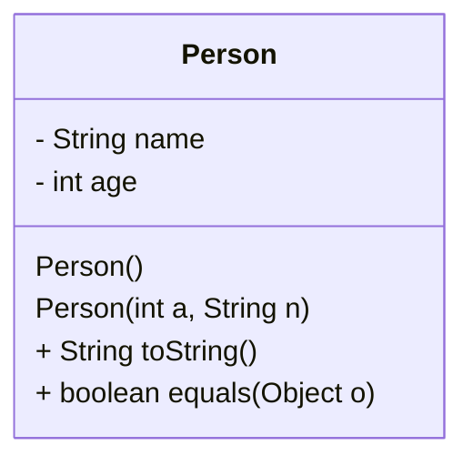

# 第八讲--Java常用核心类

### 任务目标

1、Object类定义的方法

2、覆盖Object类中常见的方法

3、Math类的常见方法和常量

### 相关知识

1、方法的覆盖

2、对象的对比

3、对象数组的排序

### 1、Object类--所有类的根类

1、Object类定义的方法 

| 方法                         | 方法的描述               |
| ---------------------------- | ------------------------ |
| public void equals(Object o) | 对象相等判断             |
| public String toString()     | 返回对象的字符串表示     |
| public int hashCode()        | 返回对象的Hash编码       |
| protecetd Object  clone()    | 创建并返回对象的一个Copy |



2、toString方法的覆盖。


```java
class Person
{
	private int age;
	private String name;
	private String address;
	Person()
	{}
	Person(int a, String n,String ad)
	{
		this.age=a;
		this.name=n;
		this.address =ad;
	}
	public String toString()
	{
		return this.name + this.age + this.address;
	}
```

2、equals方法的覆盖

```java
class Person
{
	private int age;
	private String name;
	private String address;
	Person()
	{}
	Person(int a, String n,String ad)
	{
		this.age=a;
		this.name=n;
		this.address =ad;
	}
	public String toString()
	{
		return this.name + this.age + this.address;
	}
	public boolean equals(Object o)
	{
		if(this==o)
		{
			return true;
		}
		if(o instanceof Person)
		{
			Person p = (Person)o;
			if(p.age==this.age && p.name.equals(this.name) && p.address.equals(this.address))
			{
				return true;
			}
			else
			{
				return false;
			}
		}
		else
		{
			return false;
		}
	}
}


public class Test81
{
	public static void main(String[] args)
	{
		Person p =new Person(12,"John","ningbo");
		Person p1 = new Person(13,"white","hangzhou");
		Person p2 =new Person(12,"John","ningbo");
		System.out.println(p.toString());
		System.out.println(p.equals(p2));
	}
}
```

3、public int hashCode()

```java
class Person implements Cloneable
{
	private int age;
	private String name;
	private String address;
	Person()
	{}
	Person(int a, String n,String ad)
	{
		this.age=a;
		this.name=n;
		this.address =ad;
	}
	public String toString()
	{
		return this.name + this.age + this.address;
	}
	public boolean equals(Object o)
	{
		if(this==o)
		{
			return true;
		}
		if(o instanceof Person)
		{
			Person p = (Person)o;
			if(p.age==this.age && p.name.equals(this.name) && p.address.equals(this.address))
			{
				return true;
			}
			else
			{
				return false;
			}
		}
		else
		{
			return false;
		}
	}
	public int hashCode()
	{
		int number = 0 ;
		number+=this.age;
		String s = this.name;
		for(int i=0;i<s.length();i++)
		{
			number+=s.charAt(i);
		}
		s = this.address;
		for(int i=0;i<s.length();i++)
		{
			number+=s.charAt(i);
		}
		return number;
	}
}
```

4、protected Object clone()方法

```java
class Person implements Cloneable
{
	private int age;
	private String name;
	private String address;
	Person()
	{}
	Person(int a, String n,String ad)
	{
		this.age=a;
		this.name=n;
		this.address =ad;
	}
	public String toString()
	{
		return this.name + this.age + this.address;
	}
	public boolean equals(Object o)
	{
		if(this==o)
		{
			return true;
		}
		if(o instanceof Person)
		{
			Person p = (Person)o;
			if(p.age==this.age && p.name.equals(this.name) && p.address.equals(this.address))
			{
				return true;
			}
			else
			{
				return false;
			}
		}
		else
		{
			return false;
		}
	}
	public int hashCode()
	{
		int number = 0 ;
		number+=this.age;
		String s = this.name;
		for(int i=0;i<s.length();i++)
		{
			number+=s.charAt(i);
		}
		s = this.address;
		for(int i=0;i<s.length();i++)
		{
			number+=s.charAt(i);
		}
		return number;
	}
	protected Object clone() throws CloneNotSupportedException
	{
		return super.clone();
	}
	public String getName()
	{
		return this.name;
	}
}

public class Test81
{
	public static void main(String[] args) throws CloneNotSupportedException
	{
		Person p = new Person(12,"John","ningbo");
		Person p1 = (Person)p.clone();
		System.out.print(p1.getName());

	}
}
```

5、protected void finalize()方法

```java
class Person implements Cloneable
{
	private int age;
	private String name;
	private String address;
	Person()
	{}
	Person(int a, String n,String ad)
	{
		this.age=a;
		this.name=n;
		this.address =ad;
	}
	public String toString()
	{
		return this.name + this.age + this.address;
	}
	public boolean equals(Object o)
	{
		if(this==o)
		{
			return true;
		}
		if(o instanceof Person)
		{
			Person p = (Person)o;
			if(p.age==this.age && p.name.equals(this.name) && p.address.equals(this.address))
			{
				return true;
			}
			else
			{
				return false;
			}
		}
		else
		{
			return false;
		}
	}
	public int hashCode()
	{
		int number = 0 ;
		number+=this.age;
		String s = this.name;
		for(int i=0;i<s.length();i++)
		{
			number+=s.charAt(i);
		}
		s = this.address;
		for(int i=0;i<s.length();i++)
		{
			number+=s.charAt(i);
		}
		return number;
	}
	protected Object clone() throws CloneNotSupportedException
	{
		return super.clone();
	}
	public String getName()
	{
		return this.name;
	}
	protected void finalize() throws Throwable
	{
		super.finalize();
		System.out.print("finalize object");
	}
}

public class Test81
{
	public static void main(String[] args) throws CloneNotSupportedException
	{
		Person p = new Person(12,"John","ningbo");
		Person p1 = (Person)p.clone();
		System.out.println(p1.getName());
		p1 =null;
		p=null;
		System.gc();

	}
}
```


### 2、Math类

1、Math常见的方法

```java
public class Test81
{
	public static void main(String[] args)
	{
		System.out.println(Math.sin(Math.PI/2));
		System.out.println(Math.PI);
		System.out.println(Math.E);
		System.out.println(Math.log(8)/Math.log(2));
		System.out.println(Math.random()*21);
	}
}
```

2、通过随机数产生字母

```java
public class Test82
{
public static char getLetter()
{
	return (char)(65+Math.random()*26);
}

public static char getNumber()
{
	return (char)(48+Math.random()*9);
}

public static char getletter()
{
		return (char)(97+Math.random()*26);
}
	public static void main(String[] args)
	{
		for(int i=1;i<=100;i++)
		{
			System.out.print(getLetter()+"\t");
			if(i%20==0)
			{
				System.out.print("\n");
			}
		}

		for(int i=1;i<=100;i++)
		{
			System.out.print(getNumber()+"\t");
			if(i%20==0)
			{
				System.out.print("\n");
			}
		}
		for(int i=1;i<=100;i++)
		{
			System.out.print(getletter()+"\t");
			if(i%20==0)
			{
				System.out.print("\n");
			}
		}
	}
}
```

### 3、基本包装类

1、基本包装类

| 方法    | 方法的描述 |
| ------- | ---------- |
| boolean | Boolean    |
| char    | Character  |
| byte    | Byte       |
| short   | Short      |

```java
public class Test83
{
	public static void main(String[] args)
	{
		Character c1  = new Character('F');
		Boolean b1 = new Boolean("True");
		System.out.print(c1.charValue());
		System.out.print(b1.booleanValue());
	}
}
```

### 4、 日期-时间API

1、本地日期类LocalDate。

```java
import java.time.*;
public class Test84
{
	public static void main(String[] args)
	{
		LocalDate d1 = LocalDate.now(); //静态方法 （类名+方法名）
		LocalDate d2 = LocalDate.of(2019,Month.OCTOBER,20);  //Month.OCTOBER 枚举类型
		d1 = d1.plusYears(3);
		d2 = d2.plusDays(10);
		System.out.println(d1);
		System.out.print(d2);
	}
}
```

LocalDate类的方法

| 方法                                               | 方法的描述                                              |
| -------------------------------------------------- | ------------------------------------------------------- |
| now，of                                            | 静态方法根据当前日期或指定的年、月、日构造LocalDate对象 |
| plusDays, plusWeeks, plusMonths, plusYears         | 增加天、周、月、年                                      |
| minusDays, minusWeeks, minusMonths, minusYears     | 减少天、周、月、年                                      |
| plus, minus                                        | 增加或减少一个Duration或Period                          |
| withDayOfMonth, withDayOfYear, withMonth, withYear |                                                         |
| getDayOfWeek                                       |                                                         |
| getDayOfMonth                                      |                                                         |
| getDayOfYear                                       |                                                         |
| getMonth, getMonthValue                            |                                                         |
| getYear                                            |                                                         |
| until                                              |                                                         |
| isBefore, isAfter                                  |                                                         |
| isLeapYear                                         |                                                         |
| lengthOfMonth, lengthOfYear                        | 返回LocalDate对象月的天数和年的天数                     |

2、本地时间类LocalTime

```java
import java.time.*;
public class Test85
{
	public static void main(String[] args)
	{
		LocalTime t1 = LocalTime.now(); //静态方法 （类名+方法名）
		LocalTime t2 = LocalTime.of(10,35);  
		System.out.println(t1);
		System.out.print(t2);
	}
}
```

3、本地日期时间LocalDateTime

```java
import java.time.*;
public class Test86
{
	public static void main(String[] args)
	{
		LocalDateTime t1 = LocalDateTime.now(); //静态方法 （类名+方法名）
		LocalDateTime t2 = LocalDateTime.of(2002,Month.OCTOBER,23,10,35);  //Month.OCTOBER 枚举类型
		System.out.println(t1);
		System.out.print(t2);
	}
}
```

4、Instant类、Duration类、Period类

（1）Instant类表示时间点

（2）Duration类表示时间间隔，Duration.between(start,end)表示一个时间间隔

（３）Peroid类表示日期的一段时间

```java
import java.time.*;
public class Test87
{
	public static int[] bubble(int[] array)
	{
		int t;
		for(int i =0;i<array.length-1;i++)
		{
			for(int j=array.length-1;j>i;j--)
			{
				if(array[j]<array[j-1])
				{
					t = array[j];
					array[j] =array[j-1];
					array[j-1]=t;
				}
			}
		}
		return array;
	}

	public static void main(String[] args)
	{
		int[] a = new int[100000];
		for(int i=100000;i>0;i--)
		{
			a[100000-i] = i;
		}
		Instant t1 = Instant.now();
		a = bubble(a);
		Instant t2 = Instant.now();
		Duration d1 = Duration.between(t1,t2);
		long t3 = d1.toMillis();
        //long t3 = d1.toSeconds();
		System.out.println(t3);
	}
}
```

（４）日期的间隔

```java
import java.time.*;
public class Test88
{
	public static void main(String[] args)
	{
	LocalDate t1 = LocalDate.now();
	LocalDate t2 = LocalDate.of(2020,Month.JANUARY,1);
	Period p = Period.between(t2,t1);
	System.out.println(p.getYears());
	System.out.println(p.getMonths());
	System.out.println(p.getDays());
	}
}
```

（5）使用日期函数，计算年龄

```java
import java.time.*;
class Person
{
    String name;
    Date birthday;
    Person(String n, Date d)
    {
        this.name=n;
        this.birthday=d;
    }
    public int getAge()
    {
        return (int)LocalDate.now().getYear()-this.birthday.getYear();
    }
}
public class Test89
{
	public static void main(String[] args)
	{
`		Person p = new Person("Black",LocalDate.of(1989,Month.MARCH,23));
        System.out.print(p.getAge());
	}
}
```

5、其他常用类

日期-时间API还定义一些其他表示日期和时间的类，包括Clock类、Year类、YearMonth类与MonthDay类、Month枚举以及ZonedDateTime与OffsetDateTime等。


6、日期时间解析和格式化

（1）时态数据解析

Parse、将字符串解析为日期

```java
String d = "2018-09-23";
LocalDate d = LocalDate.parse(d);
```


（2）时态数据格式化

