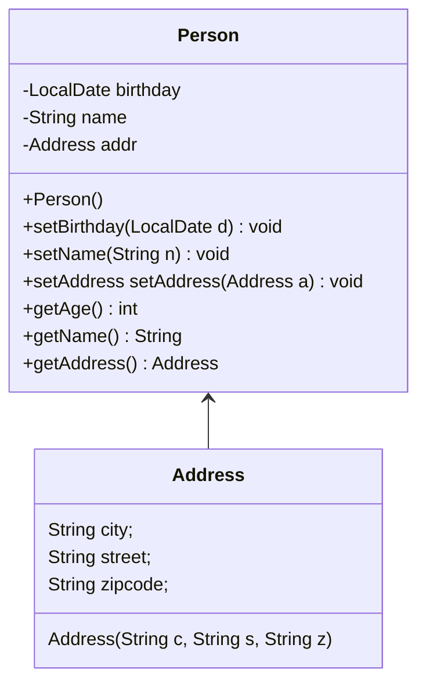

# 第九讲--Java内部类、枚举和注解

### 任务目标

1、内部类及其类型

2、常见的四种内部类

3、枚举和最终方法

4、注解的作用

### 相关知识

1、内部类与桌面事件响应程序的关系

2、枚举的常用方法

3、定义注解

### 1、内部类

1、成员内部类 




```java
import java.time.*;

class Person {
	LocalDate birthday;
	String name;
	Address add;
	class Address
	{
		String city;
		String street;
        String zipcode;
		Address(String c, String s,String z)
		{
			this.city =c;
			this.street =s;
            this.zipcode =z;
		}
		public String toString()
		{
			return this.city +"\t"+ this.street +"\t" +this.zipcode;
		}
	}
	Person(LocalDate b, String n, Address a)
	{
		this.birthday = b;
		this.name= n;
		this.add =a;
	}
	Person()
	{

	}
	public Address getAddress()
	{
		return this.add;
	}
	public String getName()
	{
		return this.name;
	}
	public int getAge()
	{
		return LocalDate.now().getYear() - this.birthday.getYear();
	}

}
public class Test90 {
	public static void main(String[] args) {
		Person p = new Person(LocalDate.of(1989,Month.MARCH,23),"zhang",new Person().new Address("Ningbo","fenghuaRoad","315211"));
		System.out.print(p.getName()+"\n");
		System.out.print(p.getAge()+"\n");
		System.out.print(p.getAddress().toString());
	}
}
```

2、局部内部类

在方法体、语句块中定义的内部类。

```java
import java.time.*;

class Person
{
    private String name;
    private LocalDate birthday;
    // private Address ad;
    Person()
    {

    }
    public String getName()
    {
        return this.name;
    }
    public int getAge()
    {
        return LocalDate.now().getYear() - this.birthday.getYear();
    }
    public String getAddress()
    {
        class Address{
            String city;
            String street;
            Address(String c, String s)
            {
                this.city=c;
                this.street =s;
            }
            public String getAddress()
            {
                return this.city+ this.street;
            }
        }
        return new Address("Ningbo","Fenghua Road").getAddress();
        // return this.add.getAddress();
    }
    public void setName(String n)
    {
        this.name=n;
    }
    public void setBirthday(LocalDate d)
    {
        this.birthday =d;
    }
    // public void setAddress(String c, String s)
    // {
    //     class Address{
    //         String city;
    //         String street;
    //         Address(String c, String s)
    //         {
    //             this.city=c;
    //             this.street =s;
    //         }
    //     }
    //     this.add = new Address(c,s);
    // }
}

public class Test91
{
public static void main(String[] aegs)
{
    Person p1 = new Person();
    p1.setName("Wanghai");
    p1.setBirthday(LocalDate.of(2001,Month.SEPTEMBER,3));
    System.out.println(p1.getName());
    System.out.println(p1.getAge());
    System.out.print(p1.getAddress());
}
}
```

3、匿名内部类

内部类是没有名字的，一般是使用一次。

```java
class Dog
{
	public void eat()
	{
		System.out.print("Dog Eat");
	}
}
public class DogTest {

	public static void main(String[] args) {
		Dog d = new Dog(){public void eat() {System.out.print("Dog eat bones");}};
		d.eat();
		}
}

abstract class Print
{
    public abstract void print(String s);
}

interface Print
{
    public abstract void print(String s);
}

public class PrintTest
{
    public static void main(String[] args)
    {
        Print p = new Print()
        {
          public void print(String m)
          {
              System.out.print(m+"message");
          }
        };
        p.print("Epson");
    }
}
```

4、静态内部类

静态内部类使用static修饰，静态内部类也称嵌套类（nested class）。

1、JavaBean模式，先调用一个无参数构造器来创建对象，然后调用setter方法来设置每个必要的参数，以及每个相关的可选参数。

```java
class Student
{
    private String name;
    private LocalDate birthday;
    private String id;
    Student()
    {
        
    }
    public void setName(String a){this.name=a;}
    public void setBirthday(LocalDate a){this.birthday=a;}
    public void setId(String a){this.id=a;}
}
```

JavaBean模式的有很严重的缺点，其构造过程被分到几个不同的set函数中，在构造过程中JavaBean可能处于不一致的状态。

2、Builder模式，为了能够保证重叠构造器模式的安全性，同时保证像JavaBean模式的好的可读性，使用静态内部类的Builder模式兼顾重叠构造器的安全性和JavaBean的可读性。

```java
import java.time.*;

class Student
{
    private String name;
    private LocalDate birthday;
    private String id;
    Student()
    {

    }
    Student(String id)
    {
        this.id=id;
    }
    Student(String id, String n)
    {
        this(id);
        this.name=n;
    }
    Student(String id, String n, LocalDate d)
    {
        this(id,n);
        this.birthday =d;
    }
    public String getName()
    {
        return this.name;
    }
    public int getAge()
    {
        return LocalDate.now().getYear() - this.birthday.getYear();
    }
    public String getid()
    {
    return this.id;
    }
    public void setName(String n)
    {
        this.name=n;
    }
    public void setBirthday(LocalDate d)
    {
        this.birthday =d;
    }
    public void setId(String id)
    {
        this.id=id;
    }
public static class Builder
{
    private String id;
    private String name;
    private LocalDate birthday;
    Builder(String id)
    {
        this.id=id;
    }
    public Builder name(String n)
    {
        this.name=n;
        return this;
    }
    public Builder birthday(LocalDate d)
    {
        this.birthday =d;
        return this;
    }
    public Student build()
    {
        return new Student(this);
    }
}

private Student(Builder b)
{
 this.id=b.id;
 this.name=b.name;
 this.birthday =b.birthday;
}
}

public class Test92
{
public static void main(String[] aegs)
{
Student s1 = new Student.Builder("11111").name("zhang").birthday(LocalDate.of(1989,Month.MARCH,23)).build();
System.out.print(s1.getName());
}
}
```

### 2、枚举类型

1、枚举类型的定义

```java
final class Direction
{
    public static final int EAST = 1;
    public static final int SOUTH = 2;
    public static final int WEST = 3;
    public static final int NORTH = 4;
}

enum Direction
{
    EAST, SOUTH, WEST,NORTH;
}

public class Direction1
{
public static void main(String[] args)
{
	Direction d = Direction.WEST;
	System.out.print(d);
	for(Direction s : Direction.values())
	{
		System.out.println(s.name() + s.ordinal());
	}
}
}

import java.time.DayOfWeek;
public class EnumSwitch {
	public static void desc(DayOfWeek d)
	{
		switch(d)
		{
			case MONDAY:
				System.out.print("week 1");
				break;
			case FRIDAY:
				System.out.print("week 5");
				break;
		}
	}
	public static void main(String[] args)
	{
		DayOfWeek f1 = DayOfWeek.MONDAY;
		desc(f1);
	}
}
```

2、枚举类型的构造方法

```java
public enum Color
{
    RED("red",1),GREEN("green",2),BLUE("blue",3),YELLOW("yellow",4);
    private String name;
    private int index;
    private Color(String n, int i)
    {
        this.name=n;
        this.index=i;
    }
    public static String getName(int i)
    {
        for(Color c: Color.values())
        {
            if(c.getIndex() == i)
            {
                return c.name;
            }
        }
        return null;
    }
    public String getName()
    {
        return name;
    }
    public void setName(String n)
    {
        this.name=n;
    }
    public int getIndex()
    {
        return index;
    }
    public void setIndex(int i)
    {
        this.index=i;
    }
    @Override
    public String toString()
    {
        return this.name + " " + this.index;
    }
    public static void main(String[] arg)
    {
        Color c = Color.RED;
        System.out.println(c.toString());
    }
}

```

### 3、注解类型

注解类型（Annotation Type)，注解以结构化的方式为程序元素提供信息，这些信息能够被外部工具（编译器、解释器）自动处理

1、为编译器提供信息，编译器可以使用注解检测错误或阻止编译警告。

2、XML文件

3、


@CopyRight

@Override

@Deprecated

@SuppressWarning