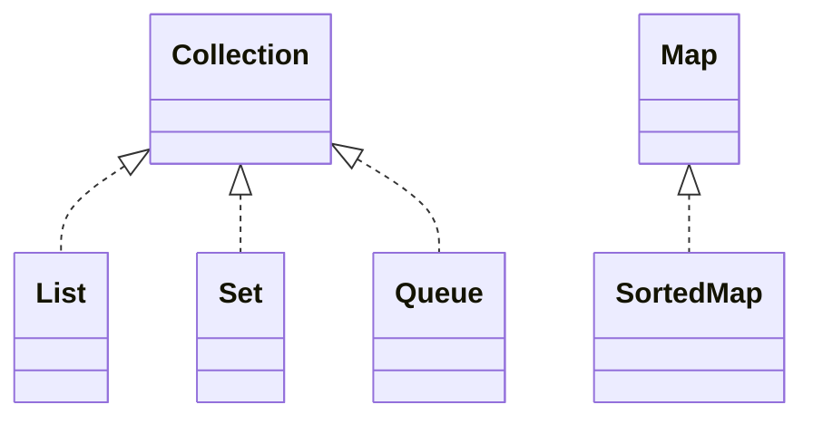
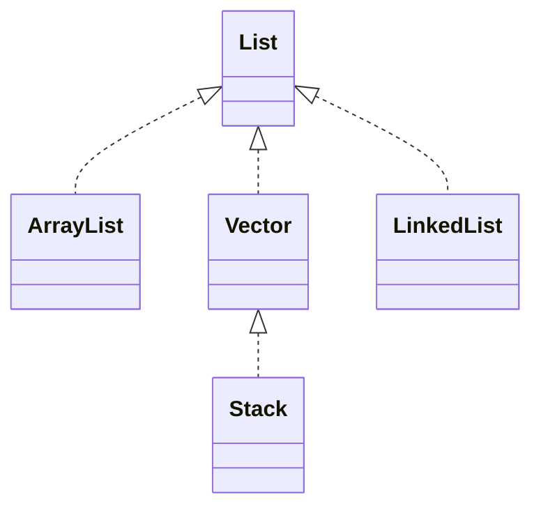

# 第十一讲--泛型与集合

### 任务目标

- [x] 泛型的介绍
- [x] 集合框架
- [x] List接口及实现类
- [x] Set接口及实现类
- [x] Queue接口及实现类
- [x] Map接口及实现类
- [x] Collection类
- [x] Stream API

### 相关知识

1、泛型可以接受各种类型的对象

2、集合和数据结构

## 1、泛型类型

1、泛型（Generics）是带一个或多个类型参数（Type parameter）的类或接口。

- [x] 定义一个Node泛型
- [x] 集合框架
- [x] List接口及实现类
- [x] Set接口及实现类
- [x] Queue接口及实现类
- [x] Map接口及实现类
- [x] Collection类
- [x] Stream API


```java
class Node<T>
{
    private T v;
    Node(){}
    Node(T t){this.v=t;}
    public T get()
    {
        return this.v;
    }
    public void set(T t)
    {
        this.v=t;
    }
}

public class Test91
{
    public static void main(String[] args)
    {
        Node<Integer> n = new Node<Integer>();
        n.set(new Integer(23));
        System.out.print(n.get()+"\n");
    }
}
```

- [x] Pair泛型定义
- [x] 集合框架
- [x] List接口及实现类
- [x] Set接口及实现类
- [x] Queue接口及实现类
- [x] Map接口及实现类
- [x] Collection类
- [x] Stream API

```java
import java.util.Map.Entry;

import java.util.Map.Entry;

class Pair<K,V> implements Entry<K,V>
{
    private K key;
    private V value;
    Pair(K k, V v)
    {
        this.key = k;
        this.value=v;
    }
    public void setKey(K k)
    {
        this.key=k;
    }
    public K getKey()
    {
        return this.key;
    }

	@Override
	public V setValue(V value) {
		// TODO Auto-generated method stub
	     if (value == null)
         throw new NullPointerException();
         V oldValue = this.value;
         this.value = value;
         return oldValue;
	}
	@Override
	public V getValue() {
		// TODO Auto-generated method stub
		return this.value;
	}
}

public class Test92
{
    public static void main(String[] args)
    {
        Pair<Integer,Integer> p = new Pair<Integer,Integer>(23,45);
        System.out.print(p.getKey()+"\n");
        System.out.print(p.getValue()+"\n");
    }
}
```

## 2、泛型方法

泛型方法（Generic method）是带类型参数的方法。类的成员方法和构造方法都可以定义为泛型方法。

```java
class Util
{
    public static<T> void swap(T[] array, int i, int j)
    {
        T temp = array[i];
        array[i] = array[j];
        array[j] = temp;
    }
    public static <K,V> boolean compare(Pair<K,V> p1, Pair<K,V> p2)
    {
        return p1.getKey().equals(p2.getKey()) &&
            p1.getValue().equals(p2.getValue());
    }
    public static void main(String[] args)
    {
        Integer[] number = {1,3,5,7};
        Util.<Integer>swap(number,0,3);
        for(Integer n:number)
        {
            System.out.println(n +" ");
        }
        Pair<Integer,String> p1 = new Pair<>(1,"apple");
        Pair<Integer,String> p2 = new Pair<>(2,"orange");
        boolean same = Util.<Integer,String>compare(p1,p2);
        System.out.println(same);
    }
}
```

- [x] 通配符（$?$）的使用
- [x] 集合框架
- [x] List接口及实现类
- [x] Set接口及实现类
- [x] Queue接口及实现类
- [x] Map接口及实现类
- [x] Collection类
- [x] Stream API

```java
public class CardDemo
{
    public static void printlist(List<?> list)
    {
        for(Object e : list)
        {
            System.out.print(e);
        }
    }
    public static void main(String[] args)
    {
        List<String> my = new ArrayList<String>();
        my.add("cat");
        my.add("dog");
        printlist(my);
    }
}
```

- [x] 有界类型参数
- [x] 集合框架
- [x] List接口及实现类
- [x] Set接口及实现类
- [x] Queue接口及实现类
- [x] Map接口及实现类
- [x] Collection类
- [x] Stream API

```java
import java.util.List;
import java.util.ArrayList;

public class CardDemo
{
    public static int get(List<? extends Number> list)
    {
        double t = 0.0;
        for(Number n : list)
        {
            t+=n.doubleValue();
         }
        return (int)t/list.size();
    }
    public static void main(String[] args)
    {
        List<Integer> my = new ArrayList<Integer>();
        my.add(3);
        my.add(30);
        System.out.print(get(my));
    }
}
```

- [x] 类型擦除
- [x] 集合框架
- [x] List接口及实现类
- [x] Set接口及实现类
- [x] Queue接口及实现类
- [x] Map接口及实现类
- [x] Collection类
- [x] Stream API

## 2、集合框架

1、JDK存在一些已定义的接口，例如Comparable接口


1. 基本操作
- [x] boolean add(E e)
- [x] boolean remove(Object o)
- [x] boolean contains(Object o)
- [x] boolean isEmpty()
- [x] int size()
- [x] Iterator iterator()
- [x] default void forEach(Consumer<? super T> action)

2. 批量操作
- [x] boolean addAll(Collection<? extends E> c)
- [x] boolean removeAll(Collection<?> c)
- [x] boolean removeIf(Predicate<? super E> filter)
- [x] boolean containsAll(Collection<?> c)
- [x] boolean retainAll(Collection<?> c)
- [x] void clear()


## 3、List接口及实现类


1、List的操作

- [x] E get(int index) 返回指定下标处的元素
- [x] E set(int index， E element) 返回指定下标处的元素
- [x] void add(int index, E element) 返回指定下标处的元素
- [x] E remove(int index) 删除指定下标处的元素
- [x] abstract boolean addAll(int index, Collection<? extends E> c)指定下标处插入集合c中的全部元素
- [x] int indexOf(Object o) 查找指定对象第一次出现的位置
- [x] int lastIndexOf(Object o)  查找指定对象最后一次出现的位置
- [x] List<E> subList(int from int to) 返回从from到to元素的一个子线性表
- [x] default void replaceAll(UnaryOperator<E> operator)将操作符应用于元素，并使用其结果替代每个元素

2、ArrayList类

- [x] ArrayList() 返回指定下标处的元素
- [x] ArrayList(Collection c) 
- [x] ArrayList(int initalCapacity)

```java
class Person {
	private int age;
	private String name;
	Person(int a, String n)
	{
		this.age=a;
		this.name=n;
	}
	public void setName(String n)
	{
		this.name=n;
	}
	public void setAge(int a)
	{
		this.age=a;
	}
	public String getName()
	{
		return this.name;
	}
	public int getAge()
	{
		return this.age;
	}

}

import java.util.List;
import java.util.ArrayList;
import java.util.Iterator;
public class Test21 {
	public static void main(String[] args) {
		// TODO Auto-generated method stub
				List<Person> list = new ArrayList<Person>();
				list.add(new Person(12,"zhang"));
				list.add(new Person(13,"wang"));
				for(int i= 0;i<list.size();i++)
				{
					System.out.println(list.get(i).getAge());
					System.out.println(list.get(i).getName());
				}
				for(Person p: list)
				{
					System.out.print(p.getAge());
					System.out.println(p.getName());
				}
				Iterator iter = list.iterator();
				while(iter.hasNext())
				{
					Person p = (Person)iter.next();
					System.out.print(p.getAge());
					System.out.println(p.getName());
				}
			}
	}
```

3、遍历集合元素

- [x] 使用简单的for循环

```java
for(int i= 0;i<list.size();i++)
{
System.out.println(list.get(i).getAge());
System.out.println(list.get(i).getName());
}			
```

- [x] 使用增强的for循环

```java
for(Person p: list)
{
System.out.print(p.getAge());
System.out.println(p.getName());
}
```

- [x] 使用迭代器
- [x] boolean hasNext()
- [x] E next() 
- [x] void remove()

```java
Iterator iter = list.iterator();
while(iter.hasNext())
{
Person p = (Person)iter.next();
System.out.print(p.getAge());
System.out.println(p.getName());
}
```

- [x] 双向迭代器
- [x] boolean hasNext()
- [x] E next() 
- [x] void remove()

```java
ListIterator iter = list.listIterator();
while(iter.hasNext())
				{
					Bird b = (Bird)iter.next();
					System.out.print(b.getName());
					System.out.println(b.getSize());
				}
				while(iter.hasPrevious())
				{
					Bird b = (Bird)iter.previous();
					System.out.print(b.getName());
					System.out.println(b.getSize());
				}
```

- [x] 数组转化为List对象
- [x] public static <T> List<T> asList(T ...a)
- [x] E next() 
- [x] void remove()

```java
//1
List<String> list = Arrays.asList(str);
//2
List<String> list  = new ArrayList<>(Arrays.asList(str));
```

## 4、Set接口及实现类


## 5、Queue接口及实现类


## 6、Map接口及实现类

```java
import java.util.HashMap;
import java.util.Map;

public class Test22 {

	public static void main(String[] args) {
		// TODO Auto-generated method stub
		String[] names = {"liu","wang","zhang"};
		String[] ages= {"10","11","12"};
		Map<String, String> persons = new HashMap<String, String>();
		for(int i=0; i<names.length;i++)
		{
			persons.put(names[i],ages[i]);
		}
		for(int i=0;i<persons.size();i++)
		{
			System.out.print(persons.keySet());
			System.out.print(persons.values());
		}
	}
}
```

## 7、Collection类

Collection类是java.util包中定义的工具类。


## 8、Stream API